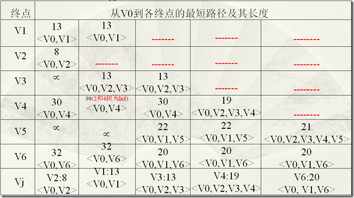

> 问题：从某顶点出发，沿图的边到达另一顶点所经过的路径中，各边上权值之和最小的一条路径——最短路径。

解决最短路的问题有以下算法，Dijkstra算法，Bellman-Ford算法，Floyd算法和SPFA算法，另外还有著名的启发式搜索算法A*。
其中Floyd算法可以求解任意两点间的最短路径的长度。笔者认为任意一个最短路算法都是基于这样一个事实：从任意节点A到任意节点B的最短路径不外乎2种可能，1是直接从A到B，2是从A经过若干个节点到B。

# Dijkstra算法

> 《数据结构》贪心  《运筹学》动态规划


(1)迪杰斯特拉(Dijkstra)算法按路径长度(看下面表格的最后一行，就是next点)递增次序产生最短路径。先把V分成两组：
S：已求出最短路径的顶点的集合
T=V-S：尚未确定最短路径的顶点集合
将T中顶点按最短路径递增的次序加入到S中
(2)求最短路径步骤

1. 初使时令 S={V0},T={其余顶点}，T中顶点对应的距离值， 若存在<V0,Vi>，为<V0,Vi>弧上的权值（和ＳＰＦＡ初始化方式不同），若不存在<V0,Vi>，为Inf。
2. 从T中选取一个其距离值为最小的顶点W(贪心体现在此处)，加入S(注意不是直接从S集合中选取，理解这个对于理解vis数组的作用至关重要)，对T中顶点的距离值进行修改：若加进W作中间顶点，从V0到Vi的距离值比不加W的路径要短，则修改此距离值（上面两个并列for循环，使用最小点更新）。
3. 重复上述步骤，直到S中包含所有顶点，即S=V为止（说明最外层是除起点外的遍历）。



# Bellman-Ford算法
> 其优于迪科斯彻算法的方面是边的权值可以为负数、实现简单，缺点是时间复杂度过高，高达O(VE)。但算法可以进行若干种优化，提高了效率。


# Foldy算法

Floyd算法的基本思想如下：从任意节点A到任意节点B的最短路径不外乎2种可能，1是直接从A到B，2是从A经过若干个节点到B，所以，我们假设dist(AB)为节点A到节点B的最短路径的距离，对于每一个节点K，我们检查dist(AK) + dist(KB) < dist(AB)是否成立，如果成立，证明从A到K再到B的路径比A直接到B的路径短，我们便设置 dist(AB) = dist(AK) + dist(KB)，这样一来，当我们遍历完所有节点K，dist(AB)中记录的便是A到B的最短路径的距离。

其核心代码如下：
```
for k in range(N):
    for i in range(N):
        for j in range(N):
            if d[i][j] > d[i][k] + d[k][j]:
                d[i][j] = d[i][k] + d[k][j]
```

[Bellman-Ford](http://www.wutianqi.com/blog/1912.html)
https://www.cnblogs.com/hxsyl/p/3270401.html
https://blog.csdn.net/Lwenjiyou_/article/details/79548577?utm_medium=distribute.pc_relevant.none-task-blog-2%7Edefault%7EBlogCommendFromMachineLearnPai2%7Edefault-2.control&depth_1-utm_source=distribute.pc_relevant.none-task-blog-2%7Edefault%7EBlogCommendFromMachineLearnPai2%7Edefault-2.control